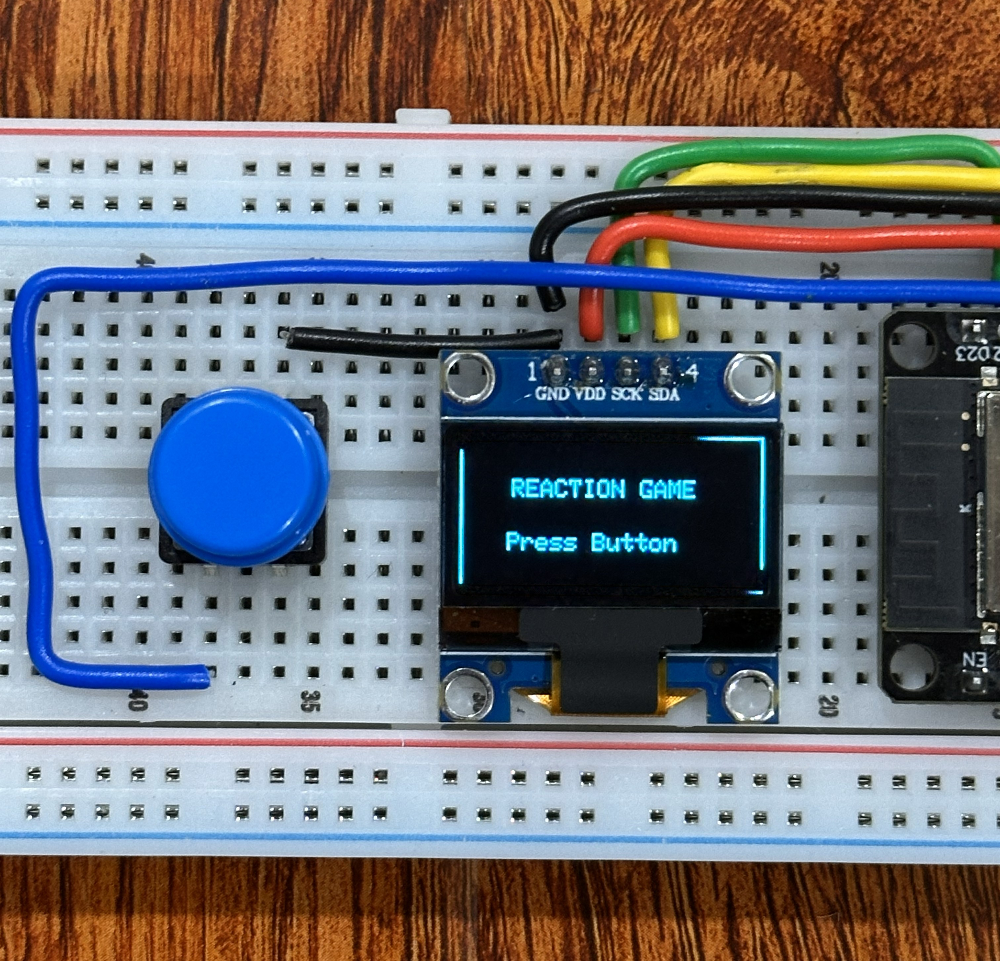
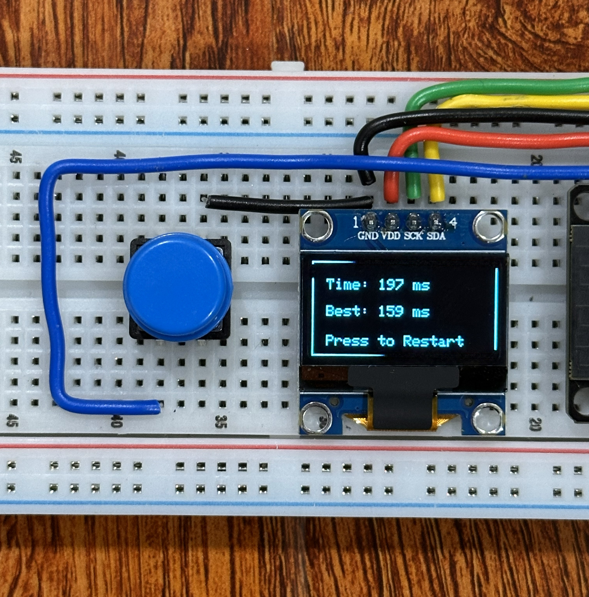
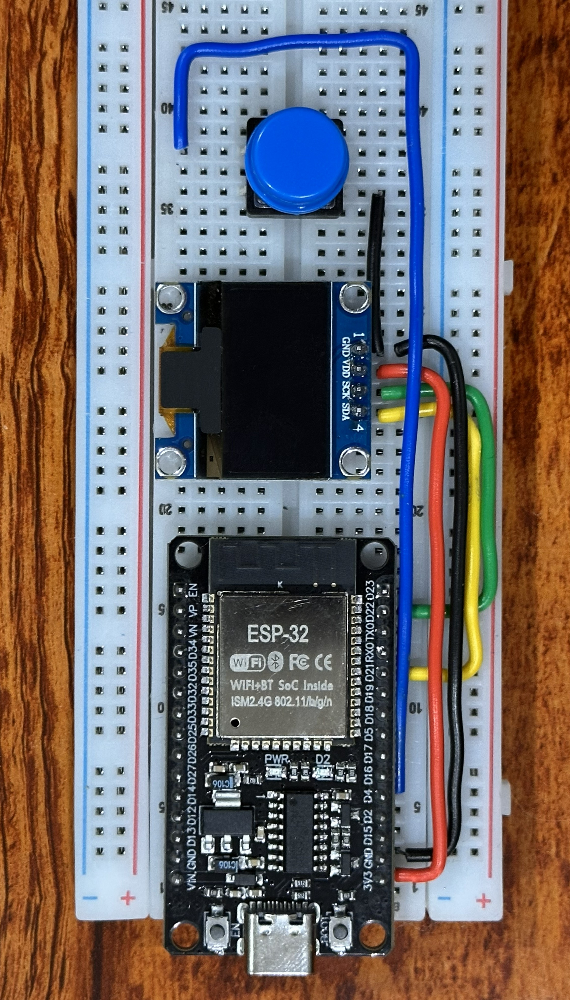

# 🎮 ESP32 Reaction Time Game

> Test your reflexes with an interactive reaction time game built on ESP32!

---

## 🧠 Overview
The **ESP32 Reaction Time Game** measures how quickly a user responds after a randomized delay.  
It features an animated OLED interface, accurate timing logic, and robust state-based input handling.

---

## 🕹️ How the Game Works
1. ▶️ Press the button to start the game  
2. ⏳ The system waits for a random delay  
3. 👀 An animated **WAIT** screen builds suspense  
4. ⚡ The OLED displays **PRESS!**  
5. ⏱️ The system measures your reaction time  
6. 🏆 Current and best reaction times are shown  

---

## ✨ Features
- 🎲 Randomized delay before reaction prompt  
- ⏱️ Accurate reaction time measurement using `millis()`  
- 🏆 Best reaction time tracking  
- 🔘 Reliable button debouncing and state-based input handling  
- 🖥️ Animated and interactive OLED user interface  
- 🧩 Clean finite state machine–based game logic  

---

## 🧰 Components Used
- ESP32  
- OLED Display (I2C)  
- Push Button  
- Resistor  
- Breadboard and jumper wires  

---

## 📚 Concepts Learned
- Digital input handling and debouncing  
- Non-blocking timing using `millis()`  
- Finite state machines in embedded systems  
- Event-driven programming  
- OLED display interfacing via I2C  
- UI design for resource-constrained devices  

---

## 🚧 Project Status
This project is **actively being improved**.

✔ Core gameplay implemented  
✔ UI improvements completed  
✔ Best score tracking added  

---

## 🔮 Planned Enhancements
- 🚫 Early button press detection with visual feedback  
- 🔊 Sound feedback using an active buzzer  

---
## 🖼️ Project Images

### 🎮 Gameplay

  
  

  <em>Start screen (left) and result screen (right)</em>

### 🔌 Hardware Setup

  

---

## 💡 Why this project?
This project focuses on **input reliability**, **state-driven logic**, and **user feedback**, making it a strong foundation for embedded systems and security-oriented hardware projects.

---
